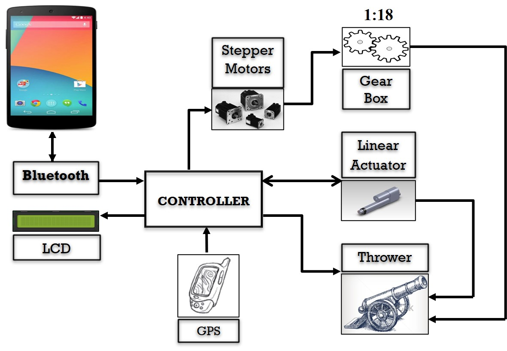
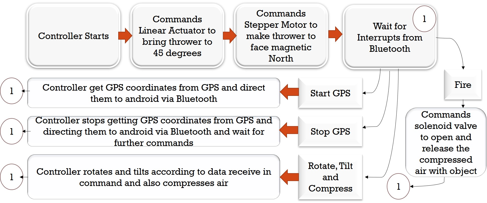

# GPS Guided Projectile Thrower 

`Final Year Project in Bachelor of Electrical Engineering`

## 1. MapApp `Android Application`

1. Get precise location of the thrower from the GPS attatched to it using Bluetooth.

1. `Present the location` on a Google Map based user interface.

1. Allow user to `select target` from map.

1. Allow user to issue `Fire` command.

## 2. Microcontroller Attached to Projectile Thrower

1. Continuously send current location to connected bluetooth devices.

1. Pan and tilt according to the target selected by user on application by using. Make use of target location, current location, pan value from geared motor, and tilt value from accelerometer.

1. Compress the air to fire `potato` using fixed pressure.

1. Release air to fire `potato`.

> Trim potato to adjust its weight and shape.

